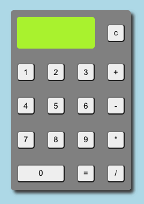
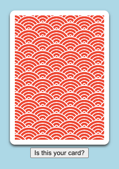
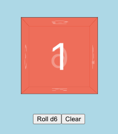

# Games Collection

I've created this project to practice my React skills and experiment with different CSS properties.

## Calculator

This is just a basic calculator that can add, subtract, multiply, and divide.

## Card Flip

A car is randomly selected and appears on screen with a CSS flip animation.

## Dice Roll

A number is randomly calculated which moves the face of the die to the corresponding number.

## Tic Tac Toe

Just a basic game of tic tac toe.

